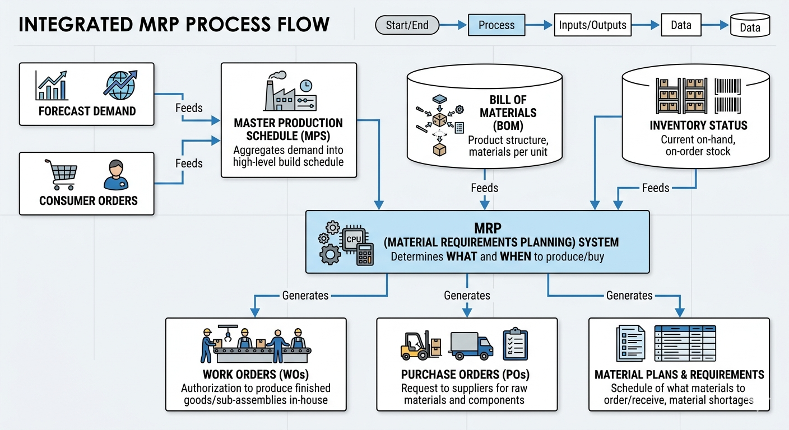
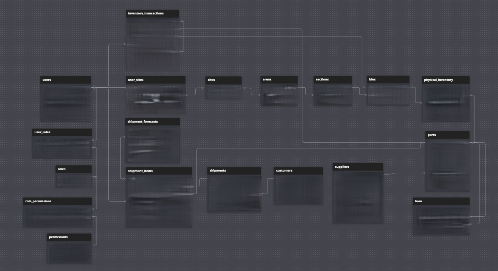
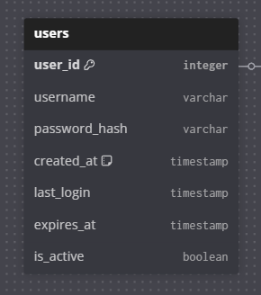

The goal with this project is to create a MiniMRP system.

Preliminary Schema for MRP system based off of generated MRP flow diagram:

STEP 1: Authentication & Seamless Provisioning

Users Table:

Plan: 
Create a login system that demonstrates security, but also seamlessly provisions guest users for seamless access.

Execution Strategy:
Check localStorage for a UUID, if none exists, provision a new guest identity.
Issue JWT Tokens for all API requests to simulate a stateless and secure environment.
7-day sliding window for guest accounts to ensure database cleanliness.
